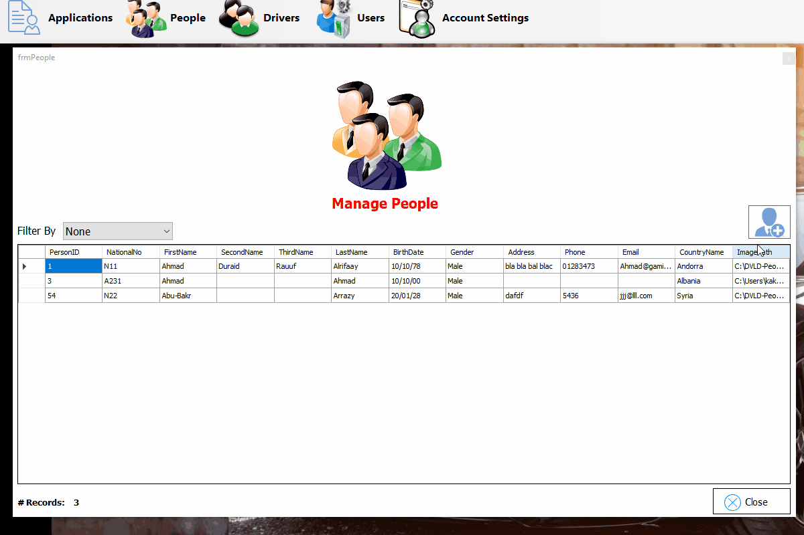
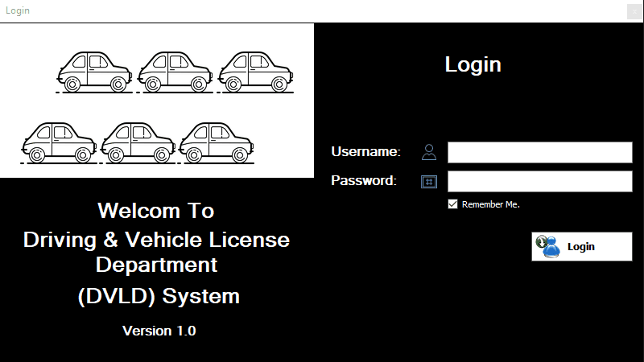
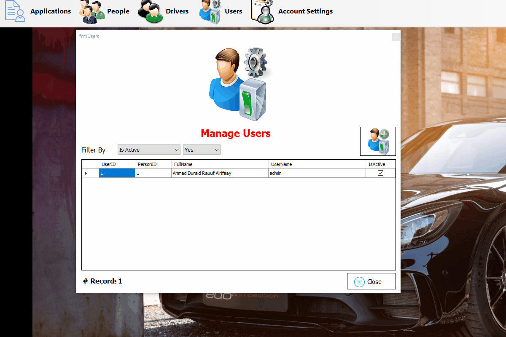
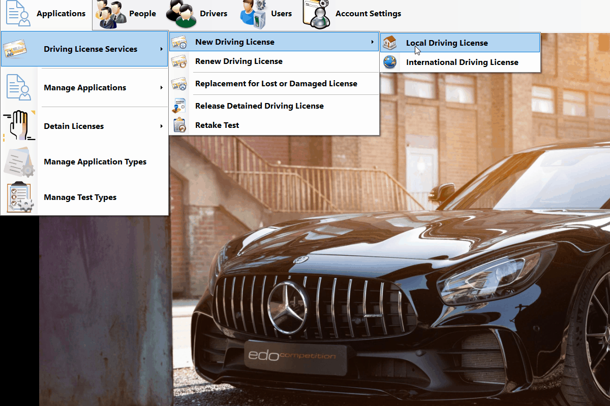

---

# DVLD System (Drivers & Vehicles License Department)

## 📌 Project Overview

The **DVLD System (Drivers & Vehicles License Department)** is a comprehensive, enterprise-level desktop application designed to simulate and manage the full lifecycle of driver licensing processes. The system handles everything from personal identity management to multi-stage testing, license issuance, renewals, and legal detentions.

## [Explanation Video on Youtube](https://youtu.be/tlWC3Qerf6I)
>  DB 📊 Tables & 🔗 Relationships

> 📊 Screenshots
   

## 🏗 Architecture & Design Patterns

The project is built using a professional **3-Tier Architecture**, ensuring high maintainability and a clear separation of concerns:

* **Presentation Layer (DVLD):** A Windows Forms-based UI designed with a modular approach, organized into logical folders for Applications, Licenses, Tests, and People.
* **Business Logic Layer (BLL):** Contains the core engine of the system, implementing business rules and validating data before persistence.
* **Data Access Layer (DAL):** Handles all database interactions using **ADO.NET**, optimized for performance and data integrity.

## 🛠 Technical Stack

* **Language:** C# (.NET Framework).
* **Database:** Microsoft SQL Server.
* **Data Access:** ADO.NET (Connected Architecture).
* **UI:** Windows Forms (WinForms).

## 🚀 Key Features

* **Identity & User Management:** Secure handling of personal records and system user accounts with permission-based access.
* **Application Lifecycle:** Management of various application types, including New Local Licenses, International Licenses, Renewals, and Replacements (Damaged/Lost).
* **Automated Testing System:** A sequential testing workflow (Vision, Written, and Practical) with appointment scheduling and result tracking.
* **License Management:** Issuance of local and international licenses, tracking expiration dates, and maintaining driver history.
* **Detention & Release System:** Full logic for detaining licenses, calculating fines, and managing the release process.
* **Advanced Data Reporting:** Utilization of complex SQL Views (e.g., `LocalDrivingLicenseApps_View1`) for real-time monitoring of statuses.

## 📐 Engineering Principles

* **Object-Oriented Programming (OOP):** Extensive use of encapsulation, inheritance, and modular classes (e.g., `clsPerson`, `clsLicense`, `clsApplication`).
* **Maintainability & Scalability:** Designed to allow the addition of new license classes or test types without altering the core infrastructure.
* **Divide & Conquer:** Complex business requirements are broken down into small, manageable components across the three layers.
* **Clean Code:** Adherence to consistent naming conventions and optimized SQL queries to prevent SQL injection and ensure performance.

## 🗄 Database Schema

The system relies on a robust relational database consisting of **14 tables**:

* **Core Entities:** `People`, `Users`, `Countries`.
* **License Components:** `LicenseClasses`, `Drivers`, `Licenses`, `InternationalLicenses`.
* **Application & Testing:** `Applications`, `TestTypes`, `TestAppointments`, `Tests`.
* **Legal:** `DetainedLicense`.

## ⚙️ How to Setup

1. **Clone the repository.**
2. **Database Configuration:** Execute the `script-generate-db-schema-only.sql` in SQL Server to generate the schema.
3. **Connection String:** Update the connection string in the `DataAccessLayer` to match your local server instance.
4. **Build:** Open the solution in Visual Studio and build the project.

---

*This project demonstrates proficiency in software engineering, database design, and desktop application development.*

---
